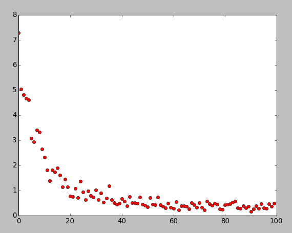

This is for TensorFlow learning

###linear_regression.py###
This is a linear regression

###logistic regression###
This is logistic regression using mnist

###save and restore model###
Document "save_and_restore_model" contains this part

#convolutional neural network
accuracy: 94.02%

