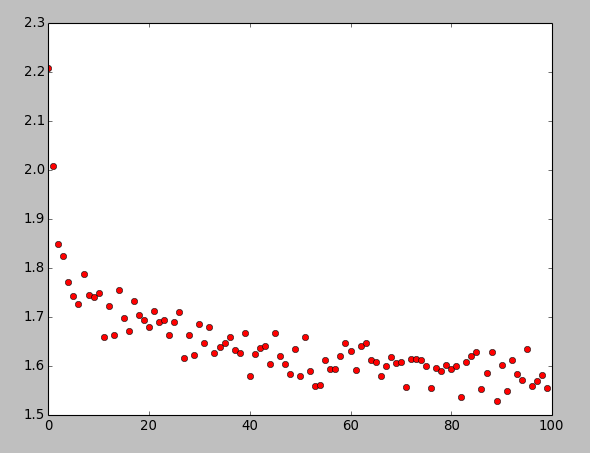

This is for TensorFlow learning

###linear regression###
This is a linear regression
linear_regression.py

###logistic regression###
This is logistic regression using mnist
logistic_regression.py

###save and restore model###
Document "save_and_restore_model" contains this part

#convolutional neural network###
convolutional_network.py
accuracy: 94.02%

#learning tensorboard###
tensorboard.py
